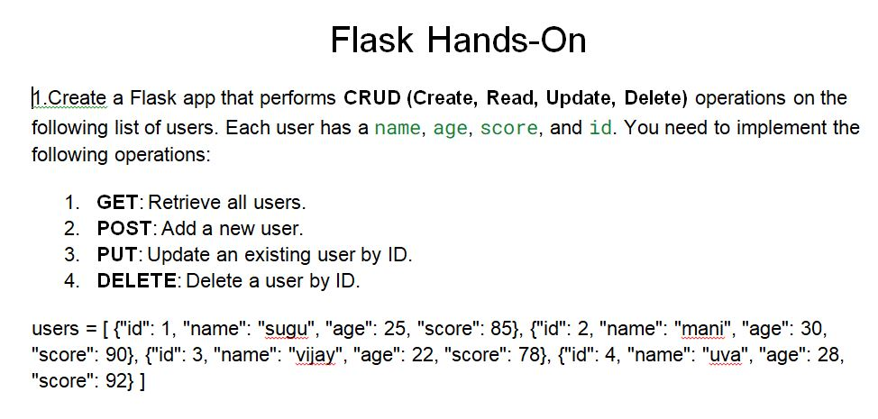
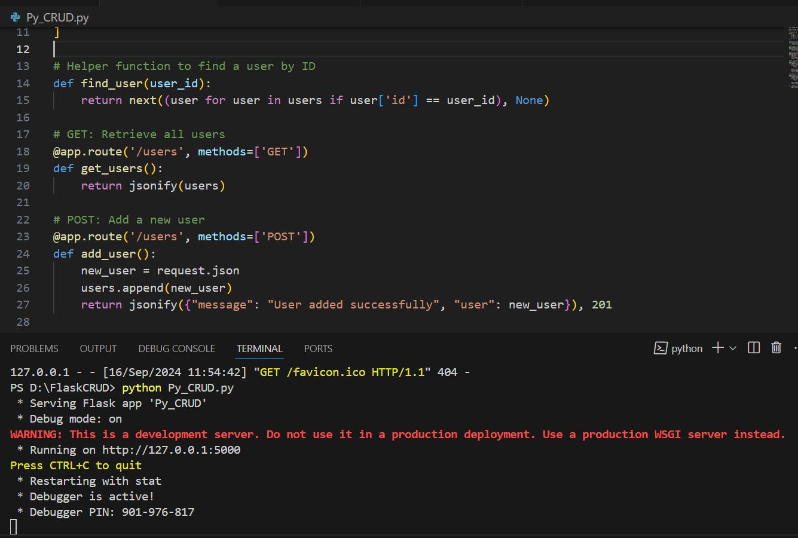

 # Usecase on API with CRUD operations
---

### Usecase details: 


### List of Packages to install	
  Install Flask by running:  
  ```Python
`pip install Flask`

`import Flask, jsonify, request`
```

### Create the Flask App with the CRUD operations as requested

Input - Sample data can be either from file formate say for e.g. csv or Data Base. In this usecase we are using a python List & Dictonary function .

```Python
users = [
    {"id": 1, "name": "sugu", "age": 25, "score": 85},
    {"id": 2, "name": "mani", "age": 30, "score": 90},
    {"id": 3, "name": "vijay", "age": 22, "score": 78},
    {"id": 4, "name": "uva", "age": 28, "score": 92}
]
```
GET /users:

o	Returns all users in JSON format.

o	Example: curl <http://localhost:5000/users>

```Python
# GET: Retrieve all users
@app.route('/users', methods=['GET'])
def get_users():
    return jsonify(users)
```
POST /users:

o	Adds a new user.

o	The new user data must be passed in JSON format.

```Python
# POST: Add a new user
@app.route('/users', methods=['POST'])
def add_user():
    new_user = request.json
    users.append(new_user)
    return jsonify({"message": "User added successfully", "user": new_user}), 201
```
PUT /users/<id>:

o	Updates an existing user by ID.
```Python
# PUT: Update an existing user by ID
@app.route('/users/<int:user_id>', methods=['PUT'])
def update_user(user_id):
    user = find_user(user_id)
    if user is None:
        return jsonify({"message": "User not found"}), 404
        data = request.json
    user.update(data)  # Update the user with the new data
    return jsonify({"message": "User updated successfully", "user": user})

```

DELETE /users/<id>:

o	Deletes a user by their ID.

```Python 
# DELETE: Delete a user by ID
@app.route('/users/<int:user_id>', methods=['DELETE'])
def delete_user(user_id):
    user = find_user(user_id)
    if user is None:
        return jsonify({"message": "User not found"}), 404
    
    users.remove(user)
    return jsonify({"message": "User deleted successfully"})
 ```

### API Main code for CRUD Operation

```Python
from flask import Flask, jsonify, request
app = Flask(__name__)
# Sample data
users = [
    {"id": 1, "name": "sugu", "age": 25, "score": 85},
    {"id": 2, "name": "mani", "age": 30, "score": 90},
    {"id": 3, "name": "vijay", "age": 22, "score": 78},
    {"id": 4, "name": "uva", "age": 28, "score": 92}
]
# Helper function to find a user by ID
def find_user(user_id):
    return next((user for user in users if user['id'] == user_id), None)
# GET: Retrieve all users
@app.route('/users', methods=['GET'])
def get_users():
    return jsonify(users)
# POST: Add a new user
@app.route('/users', methods=['POST'])
def add_user():
    new_user = request.json
    users.append(new_user)
    return jsonify({"message": "User added successfully", "user": new_user}), 201
# PUT: Update an existing user by ID
@app.route('/users/<int:user_id>', methods=['PUT'])
def update_user(user_id):
    user = find_user(user_id)
    if user is None:
        return jsonify({"message": "User not found"}), 404 
    data = request.json
    user.update(data)  # Update the user with the new data
    return jsonify({"message": "User updated successfully", "user": user})
# DELETE: Delete a user by ID
@app.route('/users/<int:user_id>', methods=['DELETE'])
def delete_user(user_id):
    user = find_user(user_id)
    if user is None:
        return jsonify({"message": "User not found"}), 404    
    users.remove(user)
    return jsonify({"message": "User deleted successfully"})

if __name__ == '__main__':
    app.run(debug=True)

```

### Output of Main API



### Main API Data retrevial from web page


## CRUD Operations

EitherRun the below Curl command for CRUD operation by using curl support for example Postman, Git Bash, VS Code, Powershell

o	Example for PUT:
```Python
 curl -X PUT -H "Content-Type: application/json" -d '{"name":"updated_user","age":29}' http://localhost:5000/users/1
 ```


o	Example for POST:
```Python
 curl -X POST -H "Content-Type: application/json" -d '{"id":5,"name":"new_user","age":26,"score":88}' http://localhost:5000/users
 ```
 

o	Example for DELETE: 
```Python
 curl -X DELETE http://localhost:5000/users/2
```

# Summary 

Code Repository in Git Hub refer the below link
<https://github.com/vadivel1975/vadi_learnings.git> 
API - Interface for batch - source can in Database, File formate like csv, online - Kafka streaming
# Special Thanks
1.Jeyachitra A
2.Sugumar
3.Jegan
4.Mayakannan

